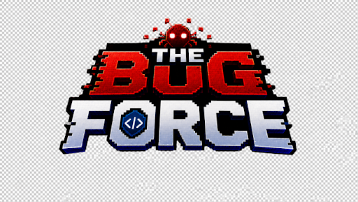

# 🐞 The Bug Force

<p align="center">
  
</p>

<p align="center">
  <a href="https://SEU-LINK-VERCEL.vercel.app">
    
  </a>
</p>

---

# 📖 Sobre o Projeto

**The Bug Force** é um jogo de tiro 2D desenvolvido em **HTML5, CSS3 e JavaScript**, utilizando a **Canvas API** como projeto da disciplina de **Programação Orientada a Objetos** do Curso Técnico em Desenvolvimento de Sistemas.

O jogo se passa durante um **Apocalipse Digital**, onde um vírus tomou conta da escola e transformou professores, códigos e computadores em inimigos virtuais.

O jogador deve sobreviver às três fases derrotando bugs, coletando itens e enfrentando chefes cada vez mais difíceis até restaurar o sistema da escola.

---

# 🎯 Objetivo

Controlar um dos integrantes da **Bug Force**, eliminar os inimigos utilizando projéteis de código binário, coletar itens para aumentar a pontuação e sobreviver às três fases do jogo.

O jogo possui modo **Solo** e **2 Jogadores**, permitindo uma experiência individual ou colaborativa.

---

# 🕹️ Como Jogar

## Controles

### Jogador 1

| Tecla  | Ação                |
| ------ | ------------------- |
| A      | Andar para esquerda |
| D      | Andar para direita  |
| W      | Pular               |
| Espaço | Atirar              |

### Jogador 2

| Tecla | Ação                |
| ----- | ------------------- |
| ←     | Andar para esquerda |
| →     | Andar para direita  |
| ↑     | Pular               |
| Enter | Atirar              |

### Controles Gerais

| Tecla | Função             |
| ----- | ------------------ |
| ESC   | Pausar / Continuar |
| Enter | Confirmar seleção  |
| P     | Confirmar diálogos |

---

# 📜 Regras do Jogo

* ❤️ Cada jogador possui um número limitado de vidas.
* 💥 Ao ser atingido por um inimigo, perde uma vida.
* 🎯 Eliminar inimigos concede pontos.
* ⭐ Alguns itens especiais podem aumentar a pontuação ou recuperar vidas.
* 🚀 O jogo possui **3 fases**.
* ⚡ A dificuldade aumenta a cada fase.
* 👾 Cada fase possui novos inimigos e um cenário diferente.
* 🏆 O jogador vence ao derrotar o chefe da terceira fase.
* 💀 Caso todas as vidas sejam perdidas, o jogo termina em **Game Over**.

---

# 👥 Personagens

## Personagens Iniciais

* Larissa
* Ueslei
* Jair
* Eliel

## Personagens Desbloqueáveis

* Sandra
* Janice
* Iza

Cada personagem possui habilidades próprias que podem auxiliar durante a partida.

---

# 👾 Inimigos

Durante o jogo o jogador enfrentará diversos inimigos criados pelo vírus digital.

## Inimigos comuns

* Bugs de Código
* Vírus
* Programas Corrompidos

## Chefes (Boss)

* Professor Carlos
* Isabella Varella

---

# 🗂️ Estrutura do Projeto

```text
TheBugForce/
│
├── assets/
│   ├── img/
│   ├── personagens/
│   ├── inimigos/
│   ├── audio/
│   └── efeitos/
│
├── css/
│   ├── style.css
│   ├── selecao.css
│   ├── jogo.css
│   └── ...
│
├── js/
│   ├── script.js
│   ├── jogo.js
│   ├── selecao.js
│   ├── classes/
│   └── ...
│
├── UML/
│   ├── caso_uso.png
│   ├── diagrama_classes.png
│   └── diagrama_sequencia.png
│
├── index.html
├── jogarSolo.html
├── jogarDupla.html
├── manual.html
├── sobre.html
└── README.md
```

---

# 📋 Requisitos Funcionais

| Código | Descrição                                                   |
| ------ | ----------------------------------------------------------- |
| RF01   | Permitir movimentação dos jogadores.                        |
| RF02   | Sistema de vidas.                                           |
| RF03   | Sistema de pontuação.                                       |
| RF04   | Itens coletáveis que aumentam pontuação ou recuperam vidas. |
| RF05   | Progressão automática entre três fases.                     |
| RF06   | Telas de Menu, Jogo, Sobre, Vitória e Game Over.            |
| RF07   | Seleção de personagens.                                     |
| RF08   | Modo Solo e Dois Jogadores.                                 |
| RF09   | Sistema de chefes (Boss).                                   |
| RF10   | Sons e músicas durante a partida.                           |

---

# ⚙️ Regras de Negócio

| Código | Descrição                                                                            |
| ------ | ------------------------------------------------------------------------------------ |
| RN01   | A dificuldade aumenta a cada fase.                                                   |
| RN02   | Cada fase possui um cenário diferente.                                               |
| RN03   | O jogador vence apenas ao concluir a terceira fase com pelo menos uma vida restante. |
| RN04   | O jogo possui uma tela de manual com controles e regras.                             |

---

# 🛠️ Requisitos Não Funcionais

| Código | Descrição                                                     |
| ------ | ------------------------------------------------------------- |
| RNF01  | Desenvolvido em JavaScript ES6+.                              |
| RNF02  | Executado diretamente no navegador utilizando HTML5 Canvas.   |
| RNF03  | Interface otimizada para computadores (1920×1080).            |
| RNF04  | Execução fluida utilizando `requestAnimationFrame` (~60 FPS). |

---

# ⚙️ Funcionalidades Técnicas

* Canvas API
* Programação Orientada a Objetos
* Sistema de colisões
* Sistema de pontuação
* Sistema de vidas
* Seleção de personagens
* Modo Solo e Multiplayer
* Progressão automática de fases
* Chefes finais
* Sons e músicas
* Telas de Menu, Manual, Sobre, Vitória e Game Over

---

# 🛠️ Tecnologias Utilizadas

* HTML5
* CSS3
* JavaScript (ES6+)
* Canvas API
* Git
* GitHub
* Vercel

---

# 🚀 Instalação e Execução

## 1. Clonar o repositório

```bash
git clone https://github.com/uesleisouza33/thebugforce
```

## 2. Abrir a pasta do projeto

```bash
cd TheBugForce
```

## 3. Executar

Abra o projeto utilizando um servidor local, como:

* Live Server (VS Code)
* Live Preview
* XAMPP
* Apache

ou simplesmente abra o arquivo **index.html** em um navegador compatível.

---

# 🌐 Sistema em Produção

**Vercel**

https://SEU-LINK-VERCEL.vercel.app

---

# 👨‍💻 Créditos

**Desenvolvedores**

* Larissa Bernardi
* Ueslei
* Jair
* Eliel

**Curso**

Técnico em Desenvolvimento de Sistemas

**Instituição**

SESI/SENAI Digital Studios

**Product Owner (Professor Orientador)**

Professor Carlos *(substitua pelo nome completo, se necessário).*

---

# 📄 Licença

Este projeto foi desenvolvido exclusivamente para fins acadêmicos como atividade da disciplina de Programação Orientada a Objetos e Versionamento.
